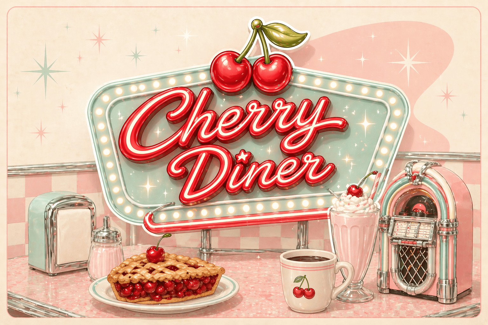
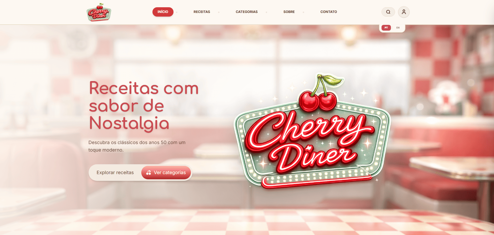
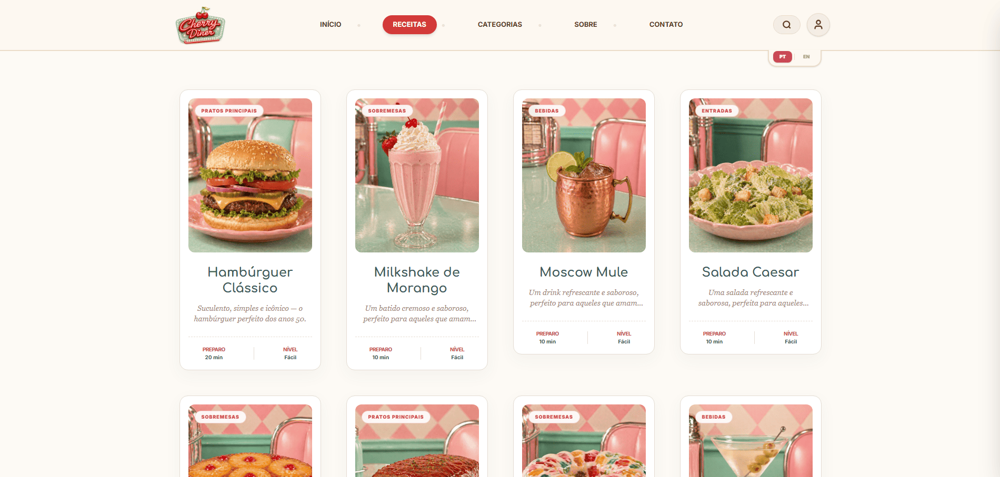
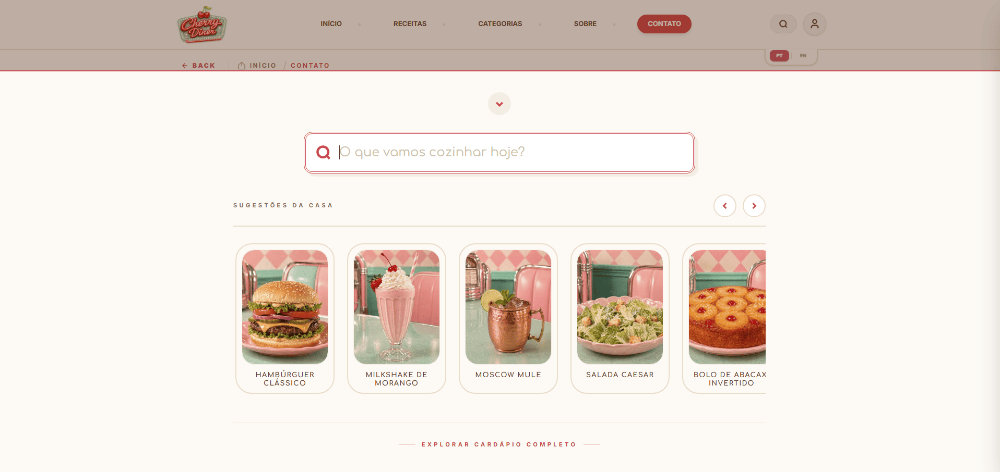
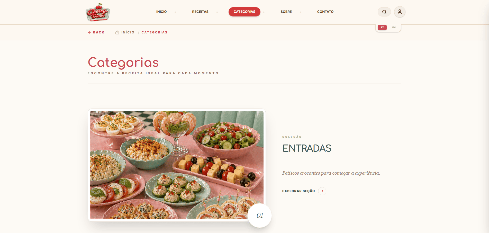
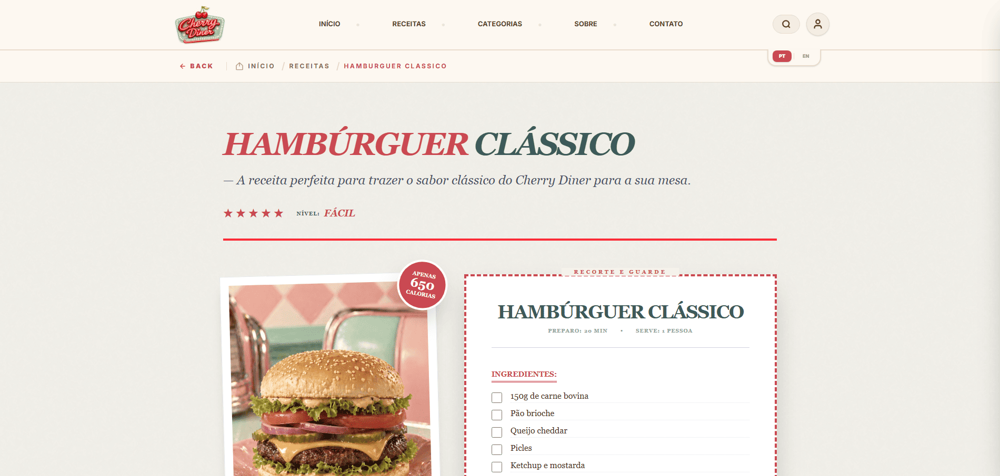
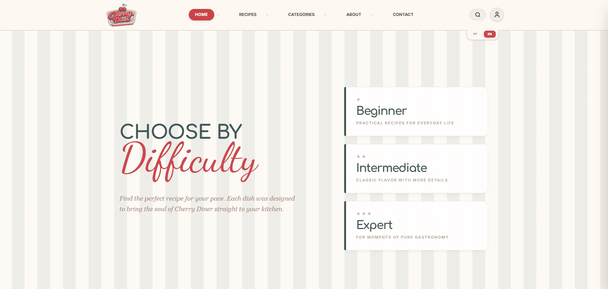
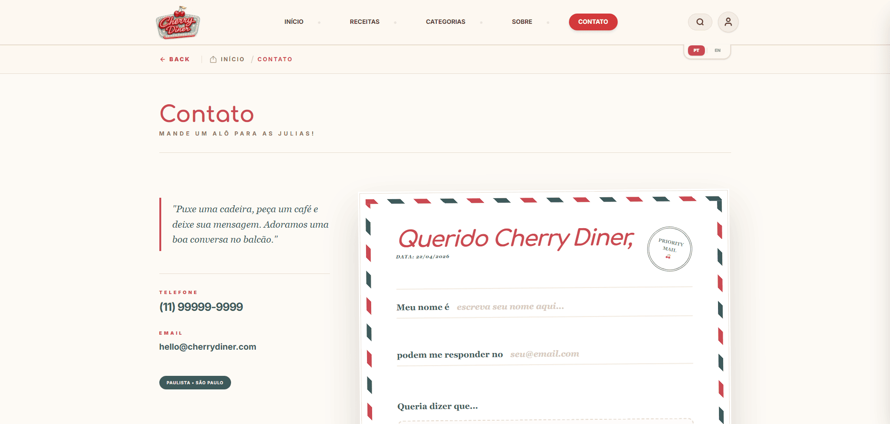
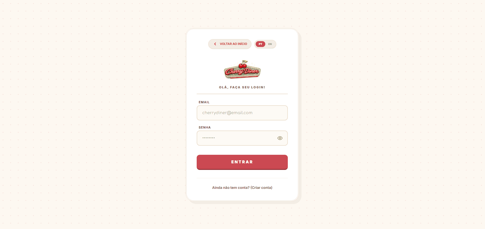

<p align="center">
  
</p>

<h1 align="center">Cherry Diner</h1>

<p align="center">
  <em>Receitas clássicas, memórias inesquecíveis.</em>
</p>

<p align="center">
  
  
  
</p>

<p align="center">
  🍒 ───────────────────────────────────────────────────────────────────── 🍒
</p>

<br/>

## ✦ Objetivo do Projeto

<p align="justify">
  
  
  O <strong>Cherry Diner</strong> nasce da intenção de traduzir a atmosfera acolhedora das lanchonetes clássicas dos anos 50 para o ambiente digital, combinando nostalgia, estética e tecnologia de forma harmônica. O projeto vai além da proposta funcional de um site de receitas. Ele foi concebido como uma experiência completa, onde o usuário não apenas encontra conteúdos, mas percorre uma jornada visual cuidadosamente construída, guiada por ritmo, composição e identidade.
  
  Cada escolha de design foi pensada estrategicamente: desde a paleta de cores pastel até a organização espacial dos elementos, criando uma interface leve, intuitiva e emocionalmente envolvente.
  A proposta central é transformar algo cotidiano, como buscar uma receita, em uma experiência memorável, sensível e visualmente sofisticada.
  
## ✦ Experiência Proposta
  
  ✧ Plataforma de receitas bilíngue (PT/EN)  
  ✧ Experiência centrada em UX e percepção visual  
  ✧ Identidade estética inspirada em diners clássicos  
  ✧ Interface fluida, responsiva e altamente refinada  
</p>

---

<br />

## ✦ Tecnologias Utilizadas

<p>Uma base tecnológica sólida, escolhida com precisão para garantir performance, escalabilidade e uma experiência refinada.</p>

<br/>

<table align="center">
<tr>
<td align="center" width="25%">
<br/><br/>
<strong>React</strong><br/>
<sub>Arquitetura baseada em componentes, promovendo organização e reutilização.</sub>
</td>
<td align="center" width="25%">
<br/><br/>
<strong>TypeScript</strong><br/>
<sub>Tipagem estática que traz segurança e consistência ao desenvolvimento.</sub>
</td>
<td align="center" width="25%">
<br/><br/>
<strong>Tailwind CSS</strong><br/>
<sub>Estilização moderna com controle preciso e foco em responsividade.</sub>
</td>
<td align="center" width="25%">
<br/><br/>
<strong>Vite</strong><br/>
<sub>Ambiente de desenvolvimento rápido com build otimizado.</sub>
</td>
</tr>
</table>

<br/>

## ✦ Funcionalidades

<p>Uma experiência pensada para unir estética, fluidez e praticidade.</p>

<br/>

<table align="center">
  <tr>
    <td width="50%" valign="top">
      
      <br/><br/>
      <strong>🏠 Página Inicial</strong><br/>
      <sub>Uma vitrine acolhedora com receitas em destaque, níveis de dificuldade e categorias organizadas com cuidado.</sub>
    </td>
    <td width="50%" valign="top">
      
      <br/><br/>
      <strong>🍽️ Todas as Receitas</strong><br/>
      <sub>Visualização completa das receitas com filtros por categorias como entradas, pratos principais, bebidas e sobremesas.</sub>
    </td>
  </tr>

  <tr>
    <td width="50%" valign="top">
      
      <br/><br/>
      <strong>🔍 Busca em Tempo Real</strong><br/>
      <sub>Busca inteligente com debounce, permitindo encontrar receitas de forma rápida e intuitiva.</sub>
    </td>
    <td width="50%" valign="top">
      
      <br/><br/>
      <strong>📂 Exploração por Categorias</strong><br/>
      <sub>Seções organizadas visualmente que facilitam a escolha do próximo prato.</sub>
    </td>
  </tr>

  <tr>
    <td width="50%" valign="top">
      
      <br/><br/>
      <strong>📖 Caderno de Receitas</strong><br/>
      <sub>Página inspirada em revistas vintage, com foco na clareza e experiência de leitura.</sub>
    </td>
    <td width="50%" valign="top">
      
      <br/><br/>
      <strong>🌍 Sistema Bilíngue</strong><br/>
      <sub>Alternância completa entre Português e Inglês com apenas um clique.</sub>
    </td>
  </tr>

  <tr>
    <td width="50%" valign="top">
      
      <br/><br/>
      <strong>✉️ Carta de Contato</strong><br/>
      <sub>Formulário inspirado em “Air Mail”, com estética retrô e interação delicada.</sub>
    </td>
    <td width="50%" valign="top">
      
      <br/><br/>
      <strong>🔑 Área do Cliente</strong><br/>
      <sub>Sistema de login que personaliza a experiência e mantém a sessão ativa.</sub>
    </td>
  </tr>
</table>

<br/>

## ✦ Instalação e Execução

<p>Configure o ambiente e execute o projeto localmente em poucos passos.</p>

### ✧ Pré-requisitos

</p>Antes de iniciar, certifique-se de ter instalado:</p>

<p>
  ✧ 
  <strong>Node.js</strong> (versão 18 ou superior)
</p>

<p>
  ✧ 📦 <strong>npm</strong> (gerenciador de pacotes padrão do Node)
</p>

<br/>

#### 1. Clone o repositório

```bash
git clone https://github.com/juliarichesky/cherry-diner.git
```

#### 2. Acesse o diretório do projeto

```bash
cd cherry-diner/cherry-diner
```

#### 3. Instale as dependências

```bash
npm install
```

#### 4. Inicie o servidor de desenvolvimento

```bash
npm run dev
```

#### 5. Acesse no navegador

```bash
http://localhost:5173
```

<br/>

## ✦ Estrutura de Pastas

```text
cherry-diner
├── public               
│   └── data             # Arquivos JSON que funcionam como o banco de dados do projeto
├── src                  
│   ├── assets           # Mídias e ícones processados pelo motor do projeto
│   ├── components       # Componentes de interface reutilizáveis
│   │   └── layout       # Estrutura base (Navbar e Footer) que envolve as páginas
│   ├── context          # Gerenciamento de estado global (Tradução PT/EN)
│   ├── pages            # Telas principais que representam as rotas do site
│   ├── utils            # Funções de suporte e mapeamento de recursos
│   ├── App.tsx          # Arquivo central de configuração de rotas e lógica global
│   └── main.tsx         # Ponto de entrada que inicia a aplicação React
├── tailwind.config.js   # Customizaçãos dos breakpoints
├── tsconfig.json        # Configurações e regras do TypeScript
└── vite.config.ts       # Configurações de compilação e performance do Vite
```

<br/>

## ✦ Desenvolvedoras

<table>
  <tr>
    <td align="center">
      <a href="https://github.com/juliarichesky">
        <br>
        <sub><b>🍒 Julia Guimarães 🍒</b></sub>
      </a><br>
      RM: 568275<br>
      Turma: 1TDSPA-2025<br><br>
      <a href="https://www.linkedin.com/in/juliarichesky/">
        
      </a>
      <a href="https://github.com/juliarichesky">
        
      </a>
    </td>
    <td align="center">
      <a href="https://github.com/juspanopoulos">
        <br>
        <sub><b>🍒 Julia Spanopoulos 🍒</b></sub>
      </a><br>
      RM: 566754<br>
      Turma: 1TDSPA-2025<br><br>
      <a href="https://www.linkedin.com/in/juspanopoulos/">
        
      </a>
      <a href="https://github.com/juspanopoulos">
        
      </a>
  </tr>
</table>
